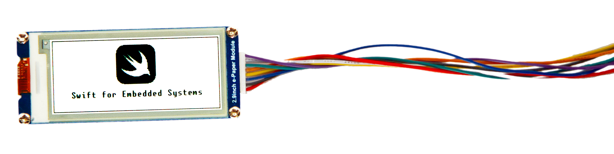
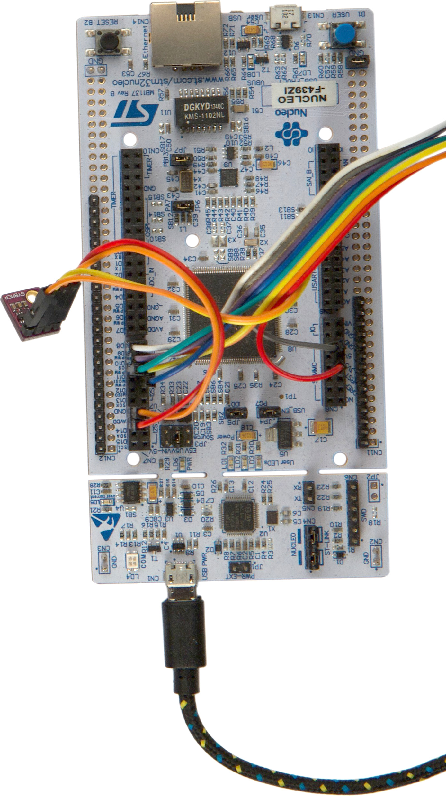

<div style="text-align: right">
    
</div>


[](https://jenkins.dragomirecky.com/job/swift-embedded/job/swift/)


This project aims to bring Swift to the world of embedded systems and IoT. It enables using Swift on microcontrollers with no operating system and with minimal resources available.

### What version of Swift does it support?
   *Swift 5.1*... enjoy the latest features of Swift on bare metal! 🚀

### Are all features of Swift available?

Yes, except for full unicode support. To save some memory, it includes simplified support only – you can use unicode characters in your strings, but they are ignored by operations like `.uppercased()` (`"žluťoučký".uppercased()` returns `"žLUťOUčKý"` instead of `"ŽLUŤOUČKÝ"`).

### Any limitations?

Code size. A "hello world" application has a little bit over one megabyte because it includes a big part of the Swift standard library. However, it is a fixed cost (does not grow proportionally with your program) and you can fit quite a lot on a microcontroller with 2MB of flash!

### What boards are supported?

Short answer: [NUCLEO-F439ZI](https://www.st.com/en/evaluation-tools/nucleo-f439zi.html), but adding support for any other STM32F4-based board with 2MB of flash memory should require only few lines of code.

[The toolchain](https://github.com/swift-embedded/swift) itself should be able to target any microcontroller using the thumbv7-m or thumbv7-em architecture. However, any practical embedded application is going to require a package providing access to hardware peripherals. I am currently focusing on supporting the STM32F4 family of microcontrollers – the [stm32](https://github.com/swift-embedded/stm32) Swift package provides access to the basic hardware peripherals of those microcontrollers, such as UART, SPI or GPIO.

To make building an embedded application as simple as possible, I have created a small [cross](https://github.com/swift-embedded/cross) command-line utility. It is a wrapper around `swift build` that handles all the things such as setting up a linker script or using the right compiler flags, making compiling an app a simple one-liner: `cross build`.

-----

> This project is in an early phase, and there is still a lot to work on. Also, if you want to know more about the process of porting Swift to embedded systems, feel free to check out my thesis [Swift for Embedded Systems](https://dspace.cvut.cz/bitstream/handle/10467/82498/F8-DP-2019-Dragomirecky-Alan-thesis.pdf).


## Getting Started

### Installing the toolchain

1. Download the latest build of the toolchain from [here](https://github.com/swift-embedded/swift-embedded/releases) and put the .xctoolchain file to either `/Library/Developer/Toolchains/` or `~/Library/Developer/Toolchains/`:

    ```bash
    $ mkdir -p /Library/Developer/Toolchains
    $ mv <downloaded file>.xctoolchain ~/Library/Developer/Toolchains
    ```

2. Activate the toolchain with:

    ```bash
    $ export TOOLCHAINS=baremetal.YYYYMMDD
    ```

3. Install the `cross` utility

	```bash
	$ brew install swift-embedded/formulae/cross
	```

4. Check that `swift` and other command-line utilities now reference the newly downloaded toolchain.

    ```bash
    $ xcrun -f swift
    /Users/alandragomirecky/Library/Developer/Toolchains/swift-LOCAL-2019-12-10-a.xctoolchain/usr/bin/swift
    ```

    > You need to have Xcode installed. Otherwise, `xcrun` won't find the toolchain.

### Running an example

1. Checkout this repository:

    ```bash
    $ git clone https://github.com/swift-embedded/swift-embedded
    ```

2. Go to a directory with some example app and compile it:

    ```bash
    $ cd swift-embedded/examples/Blinky
    $ cross build
    ```

3. Flash and run the application. One option is using the `openocd` (`brew install openocd`):

    In a terminal, run openocd (it connects to your board and starts a gdb server)

    ```bash
    $ openocd -f board/st_nucleo_f4.cfg
    ```

    In an another terminal, load your application to the board and start it:

    ```bash
    $ xcrun arm-none-eabi-gdb .build/debug/Blinky -ex 'tar ext :3333' -ex 'load'
    ```

    > Always make sure you have set the `TOOLCHAINS` environment variable, so you are using the right toolchain! Or use something like [direnv](https://github.com/direnv/direnv), so you don't have to think about it 😏.

### Using the Swift Package Manager and the `cross` utility

The Swift Package Manager is fully supported and is part of the pre-built _baremetal toolchain_. Furthermore, it should be possible to use any existing package for your bare-metal application, as long as it does not depend on some unsupported library (e. g. _Foundation_).

One thing to keep in mind is that running `swift build` builds your application for the computer at which you are running the command. To cross-compile the application for some bare-metal device, you would have to create a `destination.json` file specifying all the cross-compilation settings and run `swift build --destination destination.json`.

Creating the `destination.json` file is not a trivial task, and always having to add `--destination destination.json` gets tedious quite quickly. Both those things are solved by the `cross` utility. It works as follows:

1. Create a `Cross.toml` next to your `Package.swift` file. Its content can be as simple as:

	``` toml
	target = "STM32F439ZI"
	```

2. Running `cross build` then a) automatically creates the required `destination.json` file in the build directory and b) invokes `swift build` with the proper `--destination` flag.


### What IDEs are supported?

- Xcode is not (it does not support the `baremetal` platform introduced by this project and its extensibility is very limited).
- However, the toolchain contains modified `sourcekit-lsp`, so you should be able to use any editor with LSP support!
    - __Visual Studio Code__
        - For autocompletion, install [sourcekit-lsp](https://marketplace.visualstudio.com/items?itemName=pvasek.sourcekit-lsp--dev-unofficial) extension and set the toolchain's and sourcekit-lsp's paths in settings:

            ```JSON
            "sourcekit-lsp.serverPath": "/Path/to/toolchain/swift-LOCAL-2020-01-04-a.xctoolchain/usr/bin/sourcekit-lsp",
            "sourcekit-lsp.toolchainPath": "/Path/to/toolchain/swift-LOCAL-2020-01-04-a.xctoolchain",
            ```
        - To integrate `openocd` and `arm-none-eabi-gdb` into vscode, you can use the `Cortex-Debug` extension. Example launch configuration:

            ```JSON
            {
                "cwd": "${workspaceRoot}",
                "executable": "./.build/debug/Blinky",
                "name": "Debug Microcontroller",
                "request": "launch",
                "type": "cortex-debug",
                "servertype": "openocd",
                "configFiles": ["board/st_nucleo_f4.cfg"]
            }
            ```

            > `arm-none-eabi-gdb` does not understand Swift, so you will not be able to read Swift variables etc.

   - __Vim__
       - I use [coc.nvim](https://github.com/neoclide/coc.nvim) with the following settings:

           ```JSON
               "languageserver": {
                   "swift": {
                       "command": "xcrun",
                       "args": [
                           "sourcekit-lsp"
                       ],
                       "filetypes": [
                           "swift",
                           "c",
                           "cpp"
                       ],
                       "initializationOptions": {},
                       "settings": {},
                       "rootPatterns": [
                           "Cross.toml"
                       ],
                       "requireRootPattern": true
                   }
           ```

			> Make sure to have the `TOOLCHAINS` environment variable set!

## License

- The source code of the modified Swift toolchain is located [here](https://github.com/swift-embedded/swift) and is licensed under the [Apache License 2.0](https://github.com/swift-embedded/swift/blob/master/LICENSE.txt).
- The build of the baremetal toolchain also includes [GNU Arm Embedded Toolchain](https://developer.arm.com/tools-and-software/open-source-software/developer-tools/gnu-toolchain/gnu-rm) licensed under the [GNU General Public License v3.0](https://www.gnu.org/licenses/gpl-3.0.en.html).
- The source code in this repository is licensed under the [MIT License](https://github.com/swift-embedded/swift-embedded/blob/master/LICENSE).
